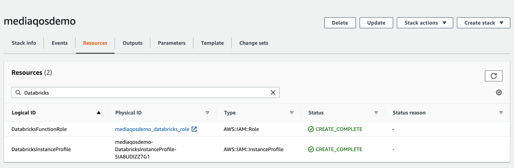

The aim of this solution is to provide the core for any streaming video platform that wants to improve their QoS system. 

- QoS Solution
  - [Solution Architecture](#Architecture-Overview)
  - [Databricks QoS Notebooks](#QoS-Notebooks)
  - [How to deploy the platform](#How-to-deploy-the-platform)
  - [License Summary](#License-Summary)
  
## Architecture Overview

The Architecture includes standard AWS components for the video streaming side of an OTT platform and Databricks as a Unified Data Analytics Platform for both the real time insights and the advanced analytics (machine learning) capabilities.

## QoS Notebooks

[The provided Notebooks](https://andreiavramescu.github.io/testrepo/notebooks/html/index.html) are showcasing an end-to-end project using [Delta](https://delta.io/) and a Delta Architecture pattern :
- the data ingestion including a `make your data available to everyone pipeline` with real-time data enrichment and anonymisation    
- real-time notifications based on a complex rules engine or machine learning based scoring 
- real-time aggregations to update the web application
- quick shareable Dashboard built directly on top of the datasets stored in your Delta Lake (for e.g. the [Network Operations Center Dashboard](https://andreiavramescu.github.io/testrepo/notebooks/html/Network%20Operations%20Dashboard.html))

For an easy import in Databricks an archive (.dbc) with all the Notebooks is provided in the Notebooks folder.  

## How to deploy the platform

As a minimum level of requirements in order to deploy the platform you must have access to an AWS account with a Databricks workspace and Docker installed on your local environment to build the code.

Deployment:

1. Clone the project and configure the Makefile and the CloudFormation template
    - set `bucket` variable to reflect the S3 bucket name prefix which will be created within a deployment region
    - set `regions` variable to reflect one or more AWS regions you want the code artifacts to be copied for CloudFormation deployment.
    - set `stack_name` for the Stack Name to use in the deployment.
    - set `profile` to the AWS CLI profile which has necessary permissions to deploy and create all the resources required. 
              
2. Build and upload the code in the source bucket in S3: `make all`. Once the build is completed,you can use the URL for your CloudFormation script in the next step. 
      
3. [Deploy the CloudFormation](cloudformation/CLOUDFORMATION.md) script either using the `make deploy` command or the CloudFormation UI. At the end of deployment you can find all the resources created during the deployment in the Resource tab.  
   
  
  
4. As best practice, you should launch Databricks clusters with instance profiles that allow you to access your data from Databricks clusters without having to embed your AWS keys in notebooks. 
   
   [Use the IAM role created in the previous step and follow the steps 4,5,6 in the guideline to secure access using instance profiles:](https://docs.databricks.com/administration-guide/cloud-configurations/aws/instance-profiles.html) 
    - Update the Databricks cross-account role with the new created IAM role that you can found the resource list mentioned above (the IAM role name includes Databricks)
    - Add the instance profile to the Databricks workspace
    - Start the cluster using the instance profile attached      
      
5. Import the Databricks archive - [QoS Notebooks](notebooks/QoS.dbc) - in your environment and update the config notebook with resources created by the CloudFormation deployment.
      
6. You are ready to go! Enjoy the QoS Solution!  

## License Summary

This sample code is made available under the MIT-0 license. See the LICENSE file.

